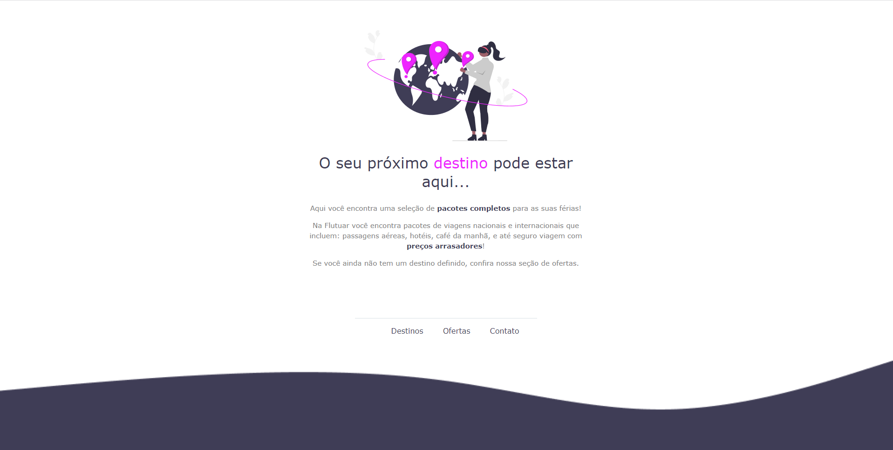

# **Trilha Explorer - Rocketseat** 📚

## 📌 **Land 1**

Ínicio da Missão:
Foi apresentado tudo que será abordado no curso do Explorer.

⬜ Mapa da Jornada;
 
⬜ Alinhamento da mentalidade;
 
⬜ Explicação sobre discord e fórum;
 
⬜ Dicas de ex alunos;
 

## 📍 **Stage 1**
Conceitos básicos da programação.

⚪ O que é programação?

* Programação é o ato de programar, capturar e tratar dados em um fluxo de eventos numa ordem lógica gerando tarefas afim de obter um resultado.
* Como programar? A programação depende de fatores para se ter um resultado, e eles são: Algoritmos; Lógica da programação e Linguagem
* E porque programar? Para resolver problemas atráves de soluções contradas.
* O que é um programa? Conjunto de uinstruções lógicas.

 
⚪ Lógica da programação;
 
⚪ O que é e como a Web funciona;
 
⚪ Fron-end VS Back-end;
 

---
## 📌 **Land 2**

Objetivos e Planejamentos.

⬜ Encontrando propósito;
 
⬜ Fortalecendo o propósito;
 
⬜ Objetivos e Metas;
 
⬜ Ajustando a mentalidade;

### **Desafio**
Qual meu propósito e meus objetivos.

## 📍 **Stage 2**
Introdução ao HTML e CSS.

⚪ Navegador e editor de código;
 
⚪ Introdução ao HTML;
* Aprendemos sobre a estrutura inical do HTML e tags.
 

⚪ Primeiro projeto e apresentação do Figma;
 
⚪ Finalização do projeto 1 com apresentação de Cores e fontes, Bordar, Alinhamento de texto, Espaçamentos. Sendo utilizado HTML e CSS.
 
⚪ Apresentação do Github e Codepen;

### **Projeto 1**

---
Conhecendo novos conceitos de HTML e CSS.

⚪Apresentação do projeto 2;
 
⚪ Estrututando HTML com tags semnânticas;
 
⚪ Conceito de Box Model do CSS;
 
⚪ Conhecendo a ferramenta de desenvolvimento DevTools;
 
⚪ Conceito de Flexbox do CSS;
 
⚪ Melhoria na acessibilidade e refatoração;
 
⚪ Ajuste finais do projeto com alinhamento e background linear-gradient e entrega do projeto.

### **Projeto 2**

---
### **Projeto 3**

Desafio avançado
 
Nesse desafio tive que recriar uma aplicação, a partir do layout disponível no Figma, para treinar tudo que foi passado no Stage 2. 

---
### **Projeto 4**

Desafio extra
 
Recriar um site de layout disponibilizado no FIgma, para treino. 

---

## 📌 **Land 3**

Aprendizado, Estudos e Técnicas.

⬜ Cronograma de estudo com Notion;
 
⬜ Potencializando o aprendizado;
 
⬜ Estudando de maneira eficiente;
 
⬜ Técnica Pomodoro;
 
⬜ Ténica Lozanov;
 
⬜ Técnica Feynmann;
 
⬜ Técnica Active Recall;

## 📍 **Stage 3**

Formulários, Validações e Customizações

⚪ Visão geral do projeto;
 
⚪ Entendendo os campos HTML;
 
⚪ Como funcionam os formulários no HTML;
 
⚪ Simulando a busca do google;
 
⚪ Iniciando a estrutura do HTML e configurações do VSCode;
 
⚪ Iniciando os estilos da página;
 
⚪ Agrupando campos com fieldset e legend;
 
⚪ Formatando o campo de texto;
 
⚪ Ajustando novos campos dentro do fieldset;
 
⚪ Estilizando o campo select;
 
⚪ Aplicando estilos aos agrupamentos restantes;
 
⚪ Checkbox customizado e com acessibilidade;
 
⚪ Criando estilos para o submit;
 
⚪ Validando cmapos e submetendo formulários;
 
⚪ Criando Formulários;